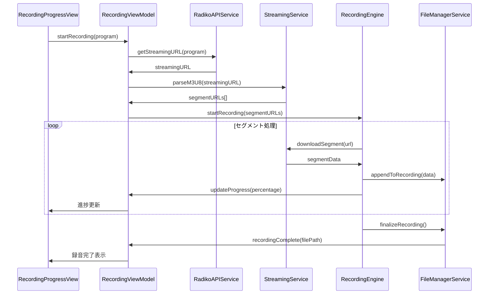
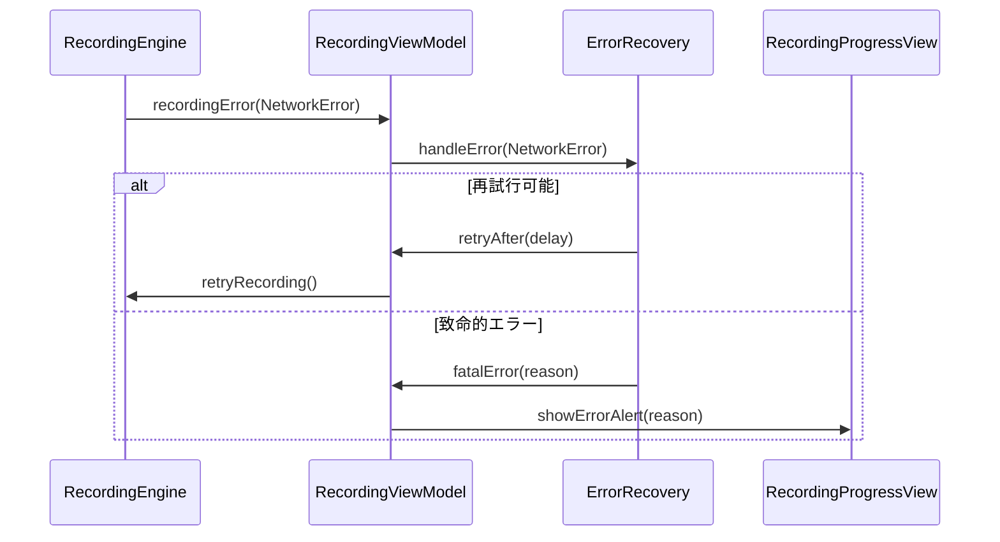

# Phase 3 詳細設計書: 録音機能実装

## 📋 目次
1. [概要](#概要)
2. [システム全体アーキテクチャ](#システム全体アーキテクチャ)
3. [録音フロー設計](#録音フロー設計)
4. [コンポーネント詳細設計](#コンポーネント詳細設計)
5. [データモデル設計](#データモデル設計)
6. [UI設計](#ui設計)
7. [エラーハンドリング設計](#エラーハンドリング設計)
8. [パフォーマンス設計](#パフォーマンス設計)
9. [セキュリティ・権限設計](#セキュリティ権限設計)
10. [テスト設計](#テスト設計)

---

## 概要

### 目的
Radikoのタイムフリー機能を利用した高品質な録音機能を実装し、ユーザーが過去1週間の番組を簡単に録音・保存できるシステムを構築する。

### 技術スタック
- **音声処理**: AVFoundation (AVAudioEngine, AVAudioConverter)
- **ネットワーク**: URLSession, Network Framework
- **並行処理**: Swift Concurrency (async/await, Actor)
- **ファイル管理**: FileManager, DocumentDirectory
- **バックグラウンド**: BackgroundTasks Framework
- **UI**: SwiftUI + MVVM アーキテクチャ

### Phase 2基盤の活用
- **認証**: RadikoAuthService（auth1/auth2フロー）
- **HTTP通信**: HTTPClient（JSON/XML対応）
- **キャッシュ**: CacheService（番組情報キャッシュ）
- **XML解析**: RadikoXMLParser（番組表解析）
- **時刻変換**: TimeConverter（25時間表記対応）

---

## システム全体アーキテクチャ

### レイヤー構成
```
┌─────────────────────────────────────────────────────────┐
│                    Presentation Layer                   │
│  ┌─────────────────┐ ┌─────────────────┐ ┌─────────────┐ │
│  │RecordingProgress│ │ ScheduleView    │ │SettingsView │ │
│  │     View        │ │                 │ │             │ │
│  └─────────────────┘ └─────────────────┘ └─────────────┘ │
│                             │                           │
└─────────────────────────────┼───────────────────────────┘
┌─────────────────────────────┼───────────────────────────┐
│                   ViewModel Layer                       │
│  ┌─────────────────┐ ┌─────────────────┐ ┌─────────────┐ │
│  │ RecordingView   │ │ ScheduleView    │ │ProgramList  │ │
│  │    Model        │ │     Model       │ │ ViewModel   │ │
│  └─────────────────┘ └─────────────────┘ └─────────────┘ │
└─────────────────────────────┼───────────────────────────┘
┌─────────────────────────────┼───────────────────────────┐
│                   Service Layer                         │
│  ┌─────────────────┐ ┌─────────────────┐ ┌─────────────┐ │
│  │RadikoAPIService │ │ StreamingService│ │RecordingEng.│ │
│  │   (統合)        │ │   (M3U8処理)    │ │ (音声録音)  │ │
│  └─────────────────┘ └─────────────────┘ └─────────────┘ │
│  ┌─────────────────┐ ┌─────────────────┐ ┌─────────────┐ │
│  │FileManagerServ. │ │RecordingSchedul.│ │ProgressMgr  │ │
│  │ (ファイル管理)   │ │ (スケジューラ)   │ │ (進捗管理)  │ │
│  └─────────────────┘ └─────────────────┘ └─────────────┘ │
└─────────────────────────────┼───────────────────────────┘
┌─────────────────────────────┼───────────────────────────┐
│                  Foundation Layer (Phase 2)            │
│  ┌─────────────────┐ ┌─────────────────┐ ┌─────────────┐ │
│  │   HTTPClient    │ │RadikoAuthService│ │CacheService │ │
│  └─────────────────┘ └─────────────────┘ └─────────────┘ │
│  ┌─────────────────┐ ┌─────────────────┐               │
│  │RadikoXMLParser  │ │  TimeConverter  │               │
│  └─────────────────┘ └─────────────────┘               │
└─────────────────────────────────────────────────────────┘
```

---

## 録音フロー設計

### 1. 基本録音フロー


### 2. エラー処理フロー


---

## コンポーネント詳細設計

### 1. RadikoAPIService（統合サービス）

Phase 2で実装したサービスを統合・拡張する統合APIサービス。

```swift
@MainActor
class RadikoAPIService: ObservableObject {
    // Phase 2コンポーネント
    private let httpClient: HTTPClientProtocol
    private let authService: RadikoAuthService
    private let xmlParser: RadikoXMLParser
    private let cacheService: CacheServiceProtocol
    
    // Phase 3拡張
    private let streamingURLCache: [String: String] = [:]
    
    // MARK: - Phase 2機能（継承）
    func authenticate() async throws -> AuthInfo
    func getStationList() async throws -> [RadioStation]
    func getProgramList(stationId: String, date: Date) async throws -> [RadioProgram]
    
    // MARK: - Phase 3新機能
    /// 番組の音声ストリーミングURL取得
    func getStreamingURL(program: RadioProgram) async throws -> URL
    
    /// M3U8プレイリスト取得
    func getM3U8Playlist(streamingURL: URL) async throws -> String
    
    /// 認証情報の自動更新
    func ensureAuthenticated() async throws -> AuthInfo
}
```

**設計のポイント**:
- Phase 2のコンポーネントを再利用
- 依存性注入によるテスタビリティ確保
- キャッシュ機能でパフォーマンス向上
- エラーハンドリングの統一

### 2. StreamingService（ストリーミング処理）

M3U8プレイリスト解析とTSセグメントダウンロードを担当。

```swift
protocol StreamingServiceProtocol {
    func parseM3U8(_ content: String) throws -> M3U8Playlist
    func downloadSegment(_ url: URL) async throws -> Data
    func downloadSegments(_ urls: [URL]) -> AsyncThrowingStream<SegmentData, Error>
}

@MainActor
class StreamingService: StreamingServiceProtocol {
    private let httpClient: HTTPClientProtocol
    private let downloadQueue: OperationQueue
    
    init(httpClient: HTTPClientProtocol) {
        self.httpClient = httpClient
        self.downloadQueue = OperationQueue()
        self.downloadQueue.maxConcurrentOperationCount = 3 // 同時ダウンロード数制限
    }
    
    /// M3U8プレイリスト解析
    func parseM3U8(_ content: String) throws -> M3U8Playlist {
        // #EXTM3U, #EXT-X-TARGETDURATION, #EXTINF 解析
        // TSセグメントURL抽出
        // 番組時間・品質情報解析
    }
    
    /// セグメント並列ダウンロード
    func downloadSegments(_ urls: [URL]) -> AsyncThrowingStream<SegmentData, Error> {
        AsyncThrowingStream { continuation in
            Task {
                for (index, url) in urls.enumerated() {
                    do {
                        let data = try await downloadSegment(url)
                        continuation.yield(SegmentData(index: index, data: data))
                    } catch {
                        continuation.finish(throwing: error)
                        return
                    }
                }
                continuation.finish()
            }
        }
    }
}
```

**設計のポイント**:
- プロトコル指向設計でテスト容易性確保
- AsyncThrowingStreamによる非同期ストリーミング
- 並列ダウンロードによる高速化
- エラー時の適切な処理継続

### 3. RecordingEngine（録音エンジン）

音声データの録音・変換・保存を担当する中核コンポーネント。

```swift
protocol RecordingEngineProtocol {
    var isRecording: Bool { get }
    var progress: RecordingProgress { get }
    
    func startRecording(program: RadioProgram, segments: AsyncThrowingStream<SegmentData, Error>) async throws
    func pauseRecording() async throws
    func resumeRecording() async throws
    func stopRecording() async throws -> RecordingResult
}

actor RecordingEngine: RecordingEngineProtocol {
    private let fileManager: FileManagerServiceProtocol
    private let audioConverter: AVAudioConverter
    private let progressManager: ProgressManagerProtocol
    
    private var recordingState: RecordingState = .idle
    private var currentRecording: RecordingSession?
    
    /// 録音開始
    func startRecording(program: RadioProgram, segments: AsyncThrowingStream<SegmentData, Error>) async throws {
        guard recordingState == .idle else {
            throw RecordingError.alreadyRecording
        }
        
        let outputURL = try fileManager.createRecordingFile(for: program)
        let session = RecordingSession(program: program, outputURL: outputURL)
        currentRecording = session
        recordingState = .recording
        
        try await processSegments(segments, session: session)
    }
    
    /// セグメント処理（TSからAAC変換）
    private func processSegments(_ segments: AsyncThrowingStream<SegmentData, Error>, 
                               session: RecordingSession) async throws {
        var processedSegments: [Int: Data] = [:]
        var nextExpectedIndex = 0
        
        for try await segment in segments {
            // TS -> AAC 変換
            let aacData = try await convertToAAC(segment.data)
            processedSegments[segment.index] = aacData
            
            // 順序保証して書き込み
            while let data = processedSegments.removeValue(forKey: nextExpectedIndex) {
                try await fileManager.appendToFile(data, at: session.outputURL)
                nextExpectedIndex += 1
                
                // 進捗更新
                let progress = calculateProgress(nextExpectedIndex, total: session.totalSegments)
                await progressManager.updateProgress(progress)
            }
        }
    }
    
    /// TS形式からAAC形換
    private func convertToAAC(_ tsData: Data) async throws -> Data {
        // AVAudioConverterを使用してTS -> AAC変換
        // VBR品質設定適用
        // メタデータ埋め込み
    }
}
```

**設計のポイント**:
- Actorパターンでスレッドセーフ性確保
- セグメント順序保証機能
- 高品質AAC変換（VBR対応）
- リアルタイム進捗管理

### 4. FileManagerService（ファイル管理）

録音ファイルの管理・保存・メタデータ処理を担当。

```swift
protocol FileManagerServiceProtocol {
    func createRecordingFile(for program: RadioProgram) throws -> URL
    func appendToFile(_ data: Data, at url: URL) async throws
    func finalizeRecording(at url: URL, program: RadioProgram) async throws -> RecordingFile
    func getRecordings() async throws -> [RecordingFile]
    func deleteRecording(_ file: RecordingFile) async throws
    func checkDiskSpace() async throws -> DiskSpaceInfo
}

class FileManagerService: FileManagerServiceProtocol {
    private let fileManager = FileManager.default
    private let recordingsDirectory: URL
    
    init() throws {
        // ~/Documents/RecRadiko2/Recordings/
        let documentsURL = try fileManager.url(for: .documentDirectory, 
                                             in: .userDomainMask, 
                                             appropriateFor: nil, 
                                             create: true)
        recordingsDirectory = documentsURL
            .appendingPathComponent("RecRadiko2", isDirectory: true)
            .appendingPathComponent("Recordings", isDirectory: true)
        
        try createDirectoryIfNeeded()
    }
    
    /// 録音ファイル作成（命名規則適用）
    func createRecordingFile(for program: RadioProgram) throws -> URL {
        let filename = generateFilename(for: program)
        let fileURL = recordingsDirectory.appendingPathComponent(filename)
        
        // 重複チェック
        if fileManager.fileExists(atPath: fileURL.path) {
            throw FileManagerError.fileAlreadyExists(fileURL)
        }
        
        // 容量チェック
        let estimatedSize = estimateFileSize(for: program)
        try checkAvailableSpace(required: estimatedSize)
        
        // 空ファイル作成
        fileManager.createFile(atPath: fileURL.path, contents: nil)
        return fileURL
    }
    
    /// ファイル名生成（重複回避）
    private func generateFilename(for program: RadioProgram) -> String {
        let dateFormatter = DateFormatter()
        dateFormatter.dateFormat = "yyyyMMdd_HHmm"
        let dateString = dateFormatter.string(from: program.startTime)
        
        let stationName = program.stationId
        let programTitle = sanitizeFilename(program.title)
        
        return "\(dateString)_\(stationName)_\(programTitle).m4a"
    }
    
    /// 録音完了処理（メタデータ埋め込み）
    func finalizeRecording(at url: URL, program: RadioProgram) async throws -> RecordingFile {
        // ID3タグ埋め込み
        try await embedMetadata(url: url, program: program)
        
        // ファイル情報取得
        let attributes = try fileManager.attributesOfItem(atPath: url.path)
        let fileSize = attributes[.size] as? Int64 ?? 0
        
        return RecordingFile(
            url: url,
            program: program,
            fileSize: fileSize,
            createdAt: Date(),
            duration: try await getAudioDuration(url: url)
        )
    }
}
```

**設計のポイント**:
- 構造化ディレクトリ管理
- 重複ファイル回避機能
- 容量監視・警告機能
- メタデータ自動埋め込み

### 5. RecordingProgressManager（進捗管理）

録音進捗の管理・通知・UI更新を担当。

```swift
@MainActor
class RecordingProgressManager: ObservableObject {
    @Published var currentProgress: RecordingProgress?
    @Published var recordingHistory: [RecordingProgress] = []
    
    private var progressUpdateTimer: Timer?
    
    /// 進捗更新
    func updateProgress(_ progress: RecordingProgress) {
        currentProgress = progress
        
        // 完了時の処理
        if progress.isCompleted {
            recordingHistory.append(progress)
            sendCompletionNotification(progress)
        }
    }
    
    /// バックグラウンド通知
    private func sendCompletionNotification(_ progress: RecordingProgress) {
        let content = UNMutableNotificationContent()
        content.title = "録音完了"
        content.body = "\(progress.program.title) の録音が完了しました"
        content.sound = .default
        
        let request = UNNotificationRequest(identifier: UUID().uuidString, 
                                          content: content, 
                                          trigger: nil)
        UNUserNotificationCenter.current().add(request)
    }
    
    /// リアルタイム進捗計算
    func calculateProgress(segmentIndex: Int, totalSegments: Int, 
                         downloadedBytes: Int64, estimatedTotalBytes: Int64) -> RecordingProgress {
        let segmentProgress = Double(segmentIndex) / Double(totalSegments)
        let byteProgress = Double(downloadedBytes) / Double(estimatedTotalBytes)
        
        // より正確な進捗算出
        let overallProgress = (segmentProgress + byteProgress) / 2.0
        
        return RecordingProgress(
            program: currentProgress?.program ?? RadioProgram.mockMorningShow,
            segmentsCompleted: segmentIndex,
            totalSegments: totalSegments,
            bytesDownloaded: downloadedBytes,
            estimatedTotalBytes: estimatedTotalBytes,
            progress: min(overallProgress, 1.0),
            speed: calculateDownloadSpeed(),
            remainingTime: calculateRemainingTime()
        )
    }
}
```

---

## データモデル設計

### 1. 録音関連モデル
```swift
/// 録音進捗情報
struct RecordingProgress: Identifiable, Codable {
    let id = UUID()
    let program: RadioProgram
    let segmentsCompleted: Int
    let totalSegments: Int
    let bytesDownloaded: Int64
    let estimatedTotalBytes: Int64
    let progress: Double // 0.0 - 1.0
    let speed: Double // bytes/sec
    let remainingTime: TimeInterval
    let startedAt: Date
    
    var isCompleted: Bool { progress >= 1.0 }
    var formattedSpeed: String { ByteCountFormatter().string(fromByteCount: Int64(speed)) + "/s" }
    var formattedRemainingTime: String { 
        DateComponentsFormatter().string(from: remainingTime) ?? "--:--" 
    }
}

/// 録音ファイル情報
struct RecordingFile: Identifiable, Codable {
    let id = UUID()
    let url: URL
    let program: RadioProgram
    let fileSize: Int64
    let createdAt: Date
    let duration: TimeInterval
    
    var formattedFileSize: String { 
        ByteCountFormatter().string(fromByteCount: fileSize) 
    }
    var formattedDuration: String { 
        DateComponentsFormatter().string(from: duration) ?? "--:--" 
    }
}

/// M3U8プレイリスト情報
struct M3U8Playlist: Codable {
    let version: Int
    let targetDuration: Double
    let segments: [M3U8Segment]
    let totalDuration: TimeInterval
    
    var estimatedFileSize: Int64 {
        // ビットレート推定による概算サイズ
        Int64(totalDuration * 128 * 1024 / 8) // 128kbps AAC想定
    }
}

struct M3U8Segment: Codable {
    let url: URL
    let duration: Double
    let sequenceNumber: Int
}
```

### 2. エラーモデル
```swift
enum RecordingError: LocalizedError, Equatable {
    case alreadyRecording
    case noStreamingURL
    case invalidM3U8(String)
    case networkError(Error)
    case audioConversionError(Error)
    case diskSpaceInsufficient(required: Int64, available: Int64)
    case filePermissionDenied(URL)
    case recordingInterrupted
    
    var errorDescription: String? {
        switch self {
        case .alreadyRecording:
            return "録音が既に進行中です"
        case .noStreamingURL:
            return "音声ストリーミングURLが取得できません"
        case .invalidM3U8(let reason):
            return "プレイリスト解析エラー: \(reason)"
        case .networkError(let error):
            return "ネットワークエラー: \(error.localizedDescription)"
        case .audioConversionError(let error):
            return "音声変換エラー: \(error.localizedDescription)"
        case .diskSpaceInsufficient(let required, let available):
            return "容量不足: \(required)MB必要、\(available)MB利用可能"
        case .filePermissionDenied(let url):
            return "ファイルアクセス権限がありません: \(url.lastPathComponent)"
        case .recordingInterrupted:
            return "録音が中断されました"
        }
    }
    
    var recoverySuggestion: String? {
        switch self {
        case .diskSpaceInsufficient:
            return "不要なファイルを削除して容量を確保してください"
        case .networkError:
            return "インターネット接続を確認してください"
        case .filePermissionDenied:
            return "アプリの権限設定を確認してください"
        default:
            return "しばらく時間をおいて再度お試しください"
        }
    }
}
```

---

## UI設計

### 1. RecordingViewModel（録音状態管理）
```swift
@MainActor
class RecordingViewModel: ObservableObject {
    @Published var recordingProgress: RecordingProgress?
    @Published var recordingState: RecordingState = .idle
    @Published var errorMessage: String?
    @Published var recordings: [RecordingFile] = []
    
    private let apiService: RadikoAPIService
    private let streamingService: StreamingService
    private let recordingEngine: RecordingEngine
    private let fileManager: FileManagerService
    
    /// 録音開始
    func startRecording(_ program: RadioProgram) async {
        do {
            recordingState = .preparing
            
            // 1. ストリーミングURL取得
            let streamingURL = try await apiService.getStreamingURL(program: program)
            
            // 2. M3U8解析
            let playlist = try await streamingService.parseStreamingURL(streamingURL)
            
            // 3. 録音開始
            recordingState = .recording
            let segments = streamingService.downloadSegments(playlist.segments.map(\.url))
            try await recordingEngine.startRecording(program: program, segments: segments)
            
            recordingState = .completed
            await loadRecordings()
            
        } catch {
            recordingState = .error
            errorMessage = error.localizedDescription
        }
    }
    
    /// 録音停止
    func stopRecording() async {
        do {
            let result = try await recordingEngine.stopRecording()
            recordingState = .idle
            await loadRecordings()
        } catch {
            errorMessage = error.localizedDescription
        }
    }
    
    /// 録音一覧読み込み
    func loadRecordings() async {
        do {
            recordings = try await fileManager.getRecordings()
        } catch {
            errorMessage = error.localizedDescription
        }
    }
}

enum RecordingState {
    case idle
    case preparing
    case recording
    case paused
    case completed
    case error
}
```

### 2. RecordingProgressView（進捗表示UI）
```swift
struct RecordingProgressView: View {
    @StateObject private var viewModel = RecordingViewModel()
    let program: RadioProgram
    
    var body: some View {
        VStack(spacing: 20) {
            // プログラム情報
            ProgramHeaderView(program: program)
            
            // 進捗表示
            if let progress = viewModel.recordingProgress {
                RecordingProgressCard(progress: progress)
            }
            
            // 制御ボタン
            RecordingControlButtons(
                state: viewModel.recordingState,
                onStart: { await viewModel.startRecording(program) },
                onPause: { await viewModel.pauseRecording() },
                onStop: { await viewModel.stopRecording() }
            )
            
            // エラー表示
            if let error = viewModel.errorMessage {
                ErrorBanner(message: error) {
                    viewModel.errorMessage = nil
                }
            }
        }
        .padding()
        .navigationTitle("録音")
        .task {
            await viewModel.loadRecordings()
        }
    }
}

struct RecordingProgressCard: View {
    let progress: RecordingProgress
    
    var body: some View {
        VStack(alignment: .leading, spacing: 12) {
            // 全体進捗
            ProgressView(value: progress.progress) {
                Text("録音進捗: \(Int(progress.progress * 100))%")
                    .font(.headline)
            }
            .progressViewStyle(LinearProgressViewStyle())
            
            // 詳細情報
            HStack {
                VStack(alignment: .leading) {
                    Text("セグメント: \(progress.segmentsCompleted)/\(progress.totalSegments)")
                    Text("ダウンロード速度: \(progress.formattedSpeed)")
                }
                Spacer()
                VStack(alignment: .trailing) {
                    Text("残り時間: \(progress.formattedRemainingTime)")
                    Text("ファイルサイズ: \(ByteCountFormatter().string(fromByteCount: progress.bytesDownloaded))")
                }
            }
            .font(.caption)
            .foregroundColor(.secondary)
        }
        .padding()
        .background(Color(.systemBackground))
        .cornerRadius(12)
        .shadow(radius: 2)
    }
}
```

---

## エラーハンドリング設計

### 1. エラー分類と対処方針
```swift
protocol ErrorRecoveryProtocol {
    func canRecover(from error: Error) -> Bool
    func recoveryStrategy(for error: Error) -> RecoveryStrategy
    func handleError(_ error: Error) async -> ErrorHandlingResult
}

class RecordingErrorRecovery: ErrorRecoveryProtocol {
    func handleError(_ error: Error) async -> ErrorHandlingResult {
        switch error {
        case RecordingError.networkError:
            return await handleNetworkError()
        case RecordingError.diskSpaceInsufficient:
            return await handleDiskSpaceError()
        case RecordingError.audioConversionError:
            return await handleConversionError()
        case RadikoError.authenticationFailed:
            return await handleAuthenticationError()
        default:
            return .fatal(error)
        }
    }
    
    private func handleNetworkError() async -> ErrorHandlingResult {
        // 1. 接続確認
        if await NetworkMonitor.shared.isConnected {
            // 2. 3回まで再試行
            return .retry(maxAttempts: 3, delay: 5.0)
        } else {
            // 3. オフライン状態
            return .suspend(reason: "ネットワーク接続を確認してください")
        }
    }
    
    private func handleDiskSpaceError() async -> ErrorHandlingResult {
        // 容量チェック・クリーンアップ提案
        let availableSpace = try? await FileManagerService().checkDiskSpace()
        return .userAction(
            message: "容量不足です。不要なファイルを削除してください。",
            actions: ["削除画面を開く", "キャンセル"]
        )
    }
}

enum ErrorHandlingResult {
    case retry(maxAttempts: Int, delay: TimeInterval)
    case suspend(reason: String)
    case userAction(message: String, actions: [String])
    case fatal(Error)
}
```

### 2. ログ・診断機能
```swift
class RecordingDiagnostics {
    static let shared = RecordingDiagnostics()
    
    func logRecordingSession(_ session: RecordingSession) {
        let diagnostic = RecordingDiagnostic(
            sessionId: session.id,
            program: session.program,
            startTime: session.startTime,
            duration: session.duration,
            segmentsProcessed: session.segmentsProcessed,
            errors: session.errors,
            performanceMetrics: session.performanceMetrics
        )
        
        // ローカルログ保存
        saveDiagnostic(diagnostic)
        
        // 匿名化データの分析送信（ユーザー同意済みの場合）
        if UserDefaults.standard.bool(forKey: "analyticsEnabled") {
            sendAnonymizedDiagnostic(diagnostic)
        }
    }
    
    func generateDiagnosticReport() -> DiagnosticReport {
        let recent = loadRecentDiagnostics(days: 7)
        return DiagnosticReport(
            totalRecordings: recent.count,
            successRate: Double(recent.filter(\.isSuccessful).count) / Double(recent.count),
            commonErrors: analyzeCommonErrors(recent),
            performanceMetrics: aggregatePerformance(recent),
            recommendations: generateRecommendations(recent)
        )
    }
}
```

---

## パフォーマンス設計

### 1. メモリ管理
```swift
class MemoryEfficientRecording {
    // ストリーミングバッファサイズ制限
    private let maxBufferSize: Int = 10 * 1024 * 1024 // 10MB
    private var bufferQueue: Queue<Data> = Queue()
    
    // セグメント処理時のメモリ効率化
    func processSegmentStreaming(_ segments: AsyncThrowingStream<SegmentData, Error>) async throws {
        for try await segment in segments {
            // バッファ管理
            if bufferQueue.totalSize > maxBufferSize {
                try await flushBuffer()
            }
            
            // セグメント処理（メモリ効率）
            let processedData = try await processSegmentInChunks(segment.data)
            bufferQueue.enqueue(processedData)
        }
        
        // 最終フラッシュ
        try await flushBuffer()
    }
    
    private func processSegmentInChunks(_ data: Data) async throws -> Data {
        // 大きなセグメントを小さなチャンクに分割して処理
        let chunkSize = 64 * 1024 // 64KB
        var processedData = Data()
        
        for offset in stride(from: 0, to: data.count, by: chunkSize) {
            let endIndex = min(offset + chunkSize, data.count)
            let chunk = data.subdata(in: offset..<endIndex)
            let converted = try await convertChunk(chunk)
            processedData.append(converted)
            
            // メモリプレッシャー監視
            if ProcessInfo.processInfo.thermalState != .nominal {
                try await Task.sleep(nanoseconds: 100_000_000) // 0.1秒待機
            }
        }
        
        return processedData
    }
}
```

### 2. 並列処理最適化
```swift
actor ConcurrentRecordingManager {
    private var activeRecordings: [UUID: RecordingSession] = [:]
    private let maxConcurrentRecordings = 2
    
    func startRecording(_ program: RadioProgram) async throws -> UUID {
        // 同時録音数制限
        guard activeRecordings.count < maxConcurrentRecordings else {
            throw RecordingError.tooManyActiveRecordings
        }
        
        let sessionId = UUID()
        let session = RecordingSession(id: sessionId, program: program)
        activeRecordings[sessionId] = session
        
        // 並列実行
        Task {
            do {
                try await performRecording(session)
                await completeRecording(sessionId)
            } catch {
                await failRecording(sessionId, error: error)
            }
        }
        
        return sessionId
    }
    
    private func performRecording(_ session: RecordingSession) async throws {
        // CPU集約的タスクは別キューで実行
        await withTaskGroup(of: Void.self) { group in
            // ダウンロード処理
            group.addTask {
                await self.downloadSegments(session)
            }
            
            // 変換処理
            group.addTask {
                await self.convertAudio(session)
            }
            
            // 進捗監視
            group.addTask {
                await self.monitorProgress(session)
            }
        }
    }
}
```

---

## セキュリティ・権限設計

### 1. ファイルアクセス権限
```swift
class SecureFileManager {
    func requestFileAccessPermission() async -> Bool {
        // macOS サンドボックス環境での安全なファイルアクセス
        return await withCheckedContinuation { continuation in
            let openPanel = NSOpenPanel()
            openPanel.canChooseDirectories = true
            openPanel.canChooseFiles = false
            openPanel.prompt = "録音ファイル保存フォルダを選択"
            
            openPanel.begin { result in
                if result == .OK {
                    // セキュリティスコープ付きブックマーク作成
                    if let url = openPanel.url {
                        self.storeSecurityScopedBookmark(url)
                        continuation.resume(returning: true)
                    }
                } else {
                    continuation.resume(returning: false)
                }
            }
        }
    }
    
    private func storeSecurityScopedBookmark(_ url: URL) {
        do {
            let bookmarkData = try url.bookmarkData(
                options: .withSecurityScope,
                includingResourceValuesForKeys: nil,
                relativeTo: nil
            )
            UserDefaults.standard.set(bookmarkData, forKey: "recordingDirectoryBookmark")
        } catch {
            print("セキュリティブックマーク作成失敗: \(error)")
        }
    }
}
```

### 2. データ保護
```swift
class SecureRecordingStorage {
    func saveRecordingSecurely(_ data: Data, to url: URL) async throws {
        // ファイル暗号化オプション（必要に応じて）
        var options: Data.WritingOptions = [.atomic]
        
        if UserDefaults.standard.bool(forKey: "encryptRecordings") {
            options.insert(.completeFileProtection)
        }
        
        try data.write(to: url, options: options)
        
        // ファイル属性設定（アクセス制限）
        try FileManager.default.setAttributes([
            .posixPermissions: 0o600 // オーナーのみ読み書き可能
        ], ofItemAtPath: url.path)
    }
}
```

---

## テスト設計

### 1. 単体テスト戦略
```swift
// StreamingServiceTests.swift
@Suite("StreamingService Tests")
struct StreamingServiceTests {
    
    @Test("M3U8プレイリスト解析テスト")
    func parseM3U8Playlist() async throws {
        // Given
        let mockHTTPClient = MockHTTPClient()
        let streamingService = StreamingService(httpClient: mockHTTPClient)
        let sampleM3U8 = """
            #EXTM3U
            #EXT-X-VERSION:3
            #EXT-X-TARGETDURATION:10
            #EXTINF:10.0,
            segment001.ts
            #EXTINF:10.0,
            segment002.ts
            #EXT-X-ENDLIST
            """
        
        // When
        let playlist = try streamingService.parseM3U8(sampleM3U8)
        
        // Then
        #expect(playlist.version == 3)
        #expect(playlist.targetDuration == 10.0)
        #expect(playlist.segments.count == 2)
        #expect(playlist.segments[0].duration == 10.0)
    }
    
    @Test("セグメント並列ダウンロードテスト")
    func downloadSegmentsConcurrently() async throws {
        // Given
        let mockHTTPClient = MockHTTPClient()
        let streamingService = StreamingService(httpClient: mockHTTPClient)
        let urls = [
            URL(string: "https://example.com/segment1.ts")!,
            URL(string: "https://example.com/segment2.ts")!
        ]
        
        // When
        var downloadedSegments: [SegmentData] = []
        let segments = streamingService.downloadSegments(urls)
        
        for try await segment in segments {
            downloadedSegments.append(segment)
        }
        
        // Then
        #expect(downloadedSegments.count == 2)
        #expect(downloadedSegments.map(\.index).sorted() == [0, 1])
    }
}
```

### 2. 統合テスト戦略
```swift
// RecordingIntegrationTests.swift
@Suite("Recording Integration Tests")
struct RecordingIntegrationTests {
    
    @Test("エンドツーエンド録音テスト")
    func endToEndRecordingFlow() async throws {
        // Given
        let testProgram = RadioProgram.mockMorningShow
        let mockAPIService = MockRadikoAPIService()
        let recordingViewModel = RecordingViewModel(apiService: mockAPIService)
        
        // When
        await recordingViewModel.startRecording(testProgram)
        
        // Then
        #expect(recordingViewModel.recordingState == .completed)
        #expect(recordingViewModel.recordings.count == 1)
        
        let recording = recordingViewModel.recordings[0]
        #expect(recording.program.id == testProgram.id)
        #expect(recording.fileSize > 0)
    }
    
    @Test("長時間録音パフォーマンステスト")
    func longRecordingPerformance() async throws {
        // 1時間番組の録音パフォーマンステスト
        let longProgram = createLongTestProgram(duration: 3600) // 1時間
        
        let startTime = Date()
        let result = try await performTestRecording(longProgram)
        let endTime = Date()
        
        let processingTime = endTime.timeIntervalSince(startTime)
        
        // パフォーマンス要件: 実時間の1.5倍以内で完了
        #expect(processingTime < longProgram.duration * 1.5)
        #expect(result.fileSize > 0)
    }
}
```

### 3. UIテスト戦略
```swift
// RecordingUITests.swift
class RecordingUITests: XCTestCase {
    
    func testRecordingProgressDisplay() {
        let app = XCUIApplication()
        app.launch()
        
        // 番組選択
        app.tables.cells.firstMatch.tap()
        
        // 録音開始
        app.buttons["録音開始"].tap()
        
        // 進捗表示確認
        let progressView = app.progressIndicators.firstMatch
        XCTAssertTrue(progressView.exists)
        
        // 進捗が更新されることを確認
        let initialProgress = progressView.value as? Float ?? 0
        
        // 5秒待機
        let expectation = expectation(description: "Progress updates")
        DispatchQueue.main.asyncAfter(deadline: .now() + 5) {
            expectation.fulfill()
        }
        wait(for: [expectation], timeout: 10)
        
        let updatedProgress = progressView.value as? Float ?? 0
        XCTAssertGreaterThan(updatedProgress, initialProgress)
    }
}
```

---

## まとめ

Phase 3では、Phase 2で構築したAPI基盤を活用し、高品質な録音機能を実装します。

### 主要な技術的特徴
- **Phase 2基盤の活用**: 認証・HTTP通信・キャッシュ機能を継承
- **Actor パターン**: スレッドセーフな並行処理
- **AsyncThrowingStream**: 効率的なストリーミング処理
- **プロトコル指向設計**: 高いテスタビリティ
- **MVVM + SwiftUI**: リアクティブなUI更新

### 品質保証
- **TDD手法の継続**: テストファースト開発
- **包括的エラーハンドリング**: 回復可能なエラー処理
- **パフォーマンス最適化**: メモリ効率・並列処理
- **セキュリティ重視**: ファイル保護・権限管理

この設計に基づいて、Phase 3のテスト仕様書作成とTDD実装を進めていきます。